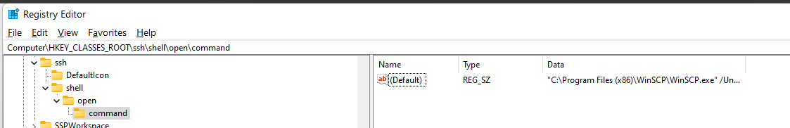

# url-protocol-handler

- access the registry ad change program


- change the defeult program on registry
```
"C:\WINDOWS\system32\cmd.exe" "%1"
```
- and change defaulticon
```
"C:\WINDOWS\system32\cmd.exe",0
```
- then have a drinks

# or Copy paste registry
```
reg add HKEY_CLASSES_ROOT\my-prot /t REG_SZ /d "My Description" /f
reg add HKEY_CLASSES_ROOT\my-prot /v "URL Protocol" /t REG_SZ /d "" /f
reg add HKEY_CLASSES_ROOT\my-prot\shell /f
reg add HKEY_CLASSES_ROOT\my-prot\shell\open /f
reg add HKEY_CLASSES_ROOT\my-prot\shell\open\command /t REG_SZ /d c:\Windows\notepad.exe /f
```
